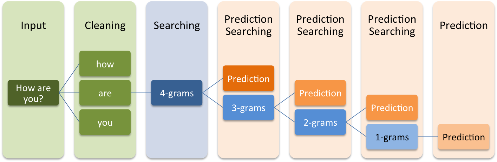
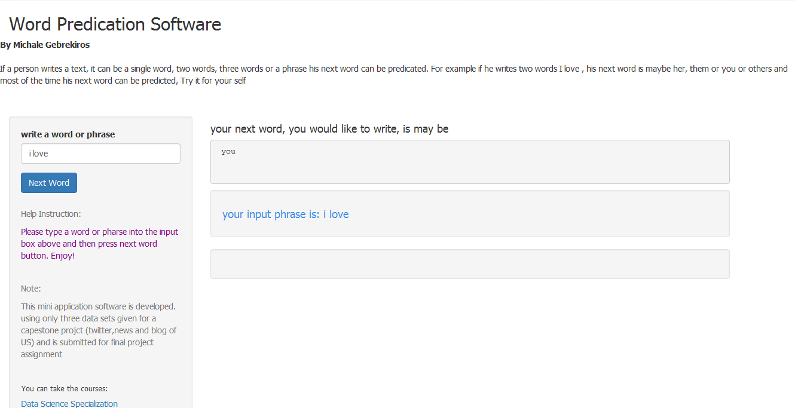

Final_Project Presentation
========================================================
author: Michale Gebrekiros
date: 4/21/2016

Outline
========================================================

- <b>**Prediction Algorithm**</b>
    - Efficient Modelling - ~~Katz back-off~~
    
    
- <b>**Instructions**</b>
    - Input - ~~Sentence (truncate the last 1~4 words)~~
    
- <b>**Experience of Application**</b>
    - User Interface 

Prediction Algorithm
========================================================
type: prompt
- <b>**Markov Chain**</b> 
<small>A mathematical system that undergoes transitions from one state to another on a state space. </small>
    
- <b>**Kat back-off**</b> 
A generative ngram language model that estimates the conditional probability of a word given its history.
    

The application
========================================================
type: prompt
<b>the application is developed using </b> 
-

***
<b> the applications's User Interface</b>
-

